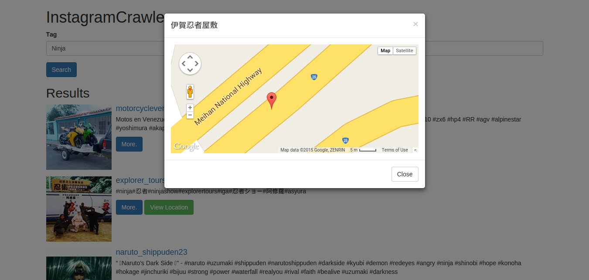

## InstagramCrawler
A simple Laravel application that demonstrates how you can crawl Instagram.

## Configuration 
1. Install Laravel `composer update`
2. Add a variable to the `.env` file called `INSTAGRAM_ACCESS_TOKEN` and set the value of it to your Instagram API token (See .env.example).

### Preview
